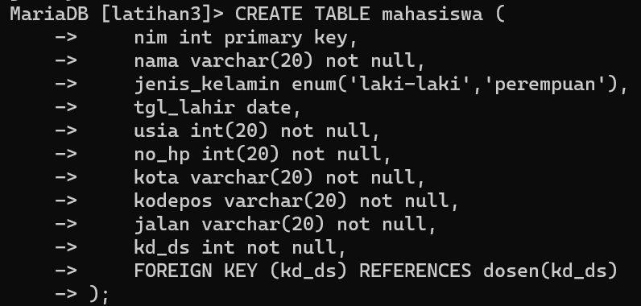

# praktikum2

## Praktikum 1

Data Model Mapping
1. Mahasiswa (nim, nama, jenis_kelamin, tgl_lahir, jalan, kota, kodepos, no_hp, kd_ds)
2. Dosen (kd_ds, nama)
3. Matakuliah (kd_mk, nama, sks)
4. JadwalMengajar (kd_ds, kd_mk, hari, jam, ruang)
5. KRSMahasiswa (nim, kd_mk, kd_ds, semester, nilai)

Buat DDL Script berdasarkan skema ERD tersebut diatas.
Jalankan script DDL tersebut pada DBMS MySQL

1. Script Tabel mahasiswa


OUTPUT

![

2. Script Tabel dosen

![

OUTPUT

![

3. Script Tabel matakuliah

![

OUTPUT

![

4. Script Tabel JadwalMengajar

![

OUTPUT

![

6. Script Tabel KRSmahasiswa

![

OUTPUT

![

DDL Script
![


# Tugas Praktikum 2
```
1. Isi data pada table tersebut sebanyak minimal 5 record data.
2. Tampilkan semua isi/record tabel! 
3. Ubah data tanggal lahir mahasiswa yang bernama Ari menjadi: 1979-08-31! 
4. Tampilkan satu baris / record data yang telah diubah tadi yaitu record dengan nama Ari saja! 
5. Hapus Mahasiswa yang bernama Dina! 
6. Tampilkan record atau data yang tanggal kelahirannya lebih dari atau sama dengan 1996-1-2! 
7. Tampilkan semua Mahasiswa yang berasal dari Bekasi dan berjenis kelamin perempuan! 
8. Tampilkan semua Mahasiswa yang berasal dari Bekasi dengan kelamin laki-laki atau Mahasiswa yang berumur lebih dari 22 tahun dengan kelamin wanita!
9. Tampilkan data nama dan alamat mahasiswa saja dari tabel tersebut
10. Tampilkan data mahasiswa terurut berdasarkan nama
```

1. Isi data pada table tersebut sebanyak minimal 5 record data.
![

2. Tampilkan semua isi/record tabel!
![

3. Ubah data tanggal lahir mahasiswa yang bernama Ari menjadi: 1979-08-31!
![

4. Tampilkan satu baris / record data yang telah diubah tadi yaitu record dengan nama Ari saja!
![

5. Hapus Mahasiswa yang bernama Dina!
![

6. Tampilkan record atau data yang tanggal kelahirannya lebih dari atau sama dengan 1996-1-2!
![

7. Tampilkan semua Mahasiswa yang berasal dari Bekasi dan berjenis kelamin perempuan!
![

8. Tampilkan semua Mahasiswa yang berasal dari Bekasi dengan kelamin laki-laki atau Mahasiswa yang berumur lebih dari 22 tahun dengan kelamin wanita!
![

9. Tampilkan data nama dan alamat mahasiswa saja dari tabel tersebut
![

10. Tampilkan data mahasiswa terurut berdasarkan nama
![


Evaluasi dan Pertanyaan
1. Apa bedanya penggunaan BETWEEN dan penggunaan operator >= dan <= ?
(misal: tgl_lahir BETWEEN '1990-10-10' AND '1992-10-11')
(misal: tgl_lahir >= '1990-10-10' AND tgl_lahir <= '1992-10-11')
```
Operator BETWEEN digunakan untuk memeriksa apakah sebuah nilai berada di antara dua nilai yang diberikan, termasuk kedua nilai tersebut. Contoh penggunaannya adalah tgl_lahir BETWEEN '1990-10-10' AND '1992-10-11', yang artinya mengambil data dengan tanggal lahir di antara 10 Oktober 1990 dan 11 Oktober 1992, termasuk kedua tanggal tersebut.
Sedangkan operator >= dan <= digunakan untuk membandingkan nilai dan mengambil data dengan nilai yang lebih besar atau lebih kecil dari suatu nilai tertentu. Contoh penggunaannya adalah tgl_lahir >= '1990-10-10' AND tgl_lahir <= '1992-10-11', yang artinya mengambil data dengan tanggal lahir yang lebih besar atau sama dengan 10 Oktober 1990 dan lebih kecil atau sama dengan 11 Oktober 1992.
```
2. Berikan kesimpulan anda!
```
Data Manipulation Language (DML) adalah bahasa pemrograman yang digunakan untuk mengakses, memanipulasi dan mengelola data dalam database. DML memungkinkan pengguna untuk melakukan operasi seperti menambahkan data baru, memperbarui data yang ada, menghapus data, dan mengambil data untuk mendapatkan data yang dibutuhkan.

Di DML, pengguna dapat mengakses data menggunakan perintah SQL (Structured Query Language). SQL adalah bahasa standar untuk mengakses dan mengelola data dalam basis data relasional. Perintah SQL yang digunakan dalam DML adalah untuk menyisipkan, memodifikasi, menghapus, dan menampilkan data seperti dijelaskan di atas. 
```


